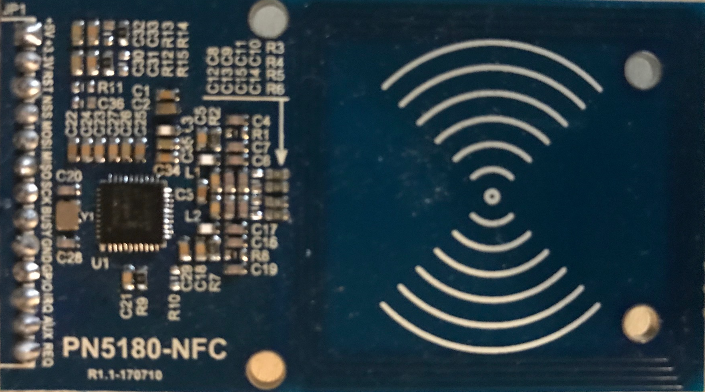
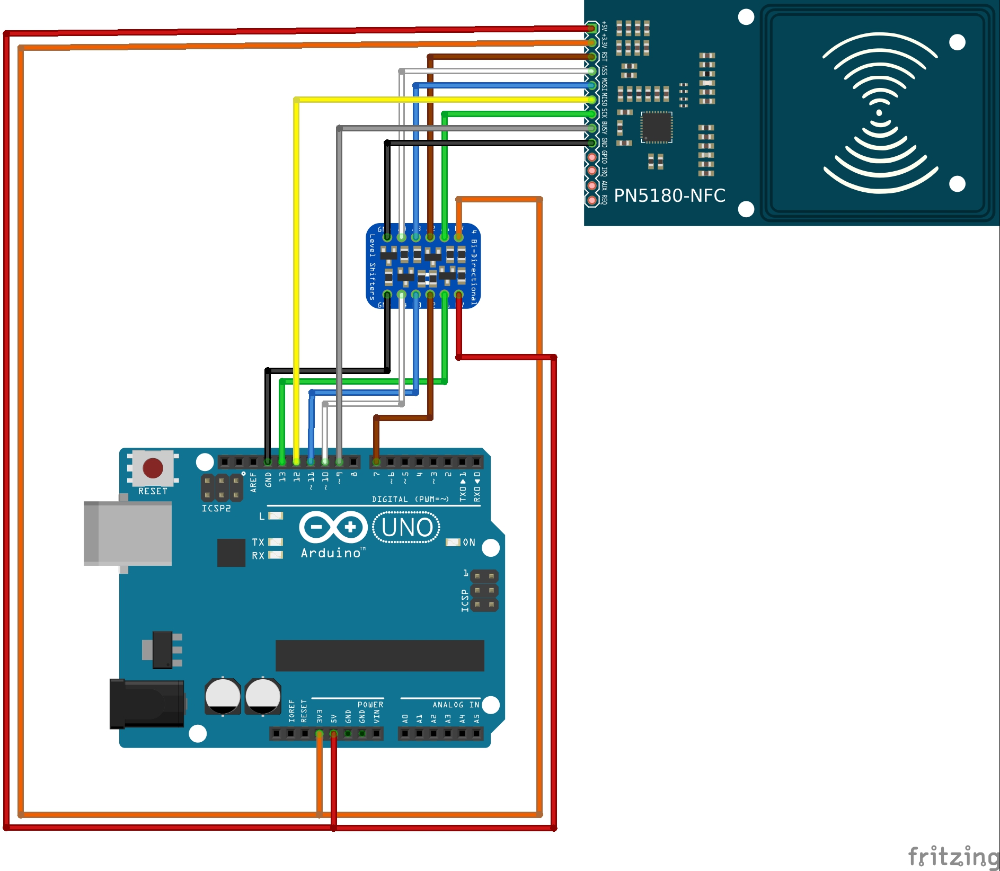

# PN5180-Library

Arduino Uno / Arduino ESP-32 library for PN5180-NFC Module from NXP Semiconductors

Release Notes:

Version 1.1 - 26.10.2018
	
	* Cleanup, bug fixing, refactoring
	* Automatic check for Arduino vs. ESP-32 platform via compiler switches
	* Added open pull requests
	* Working on documentation
	
Version 1.0.x - 21.09.2018

	* Initial versions
	